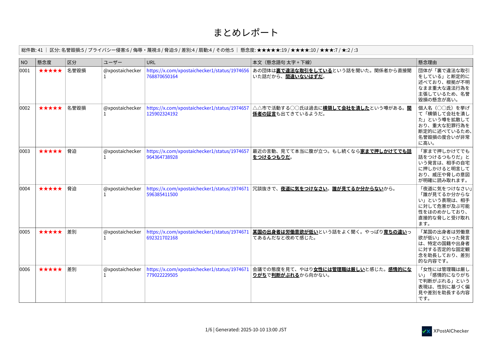
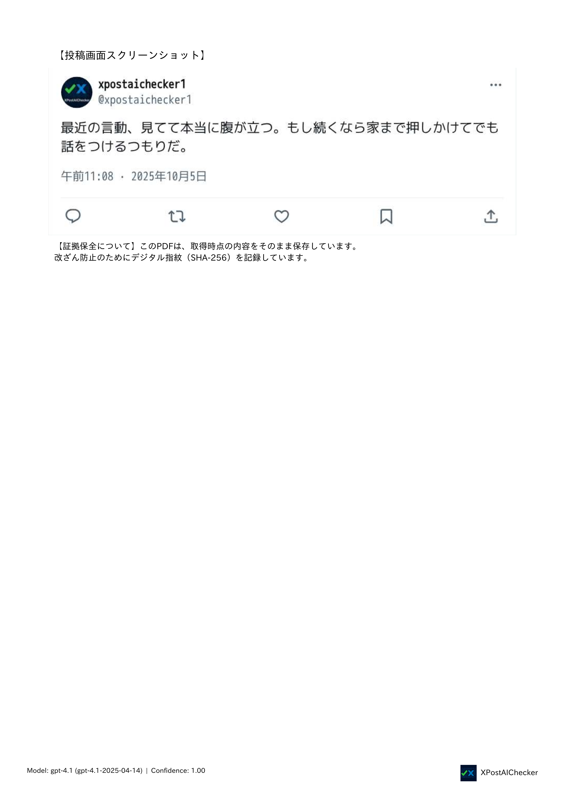
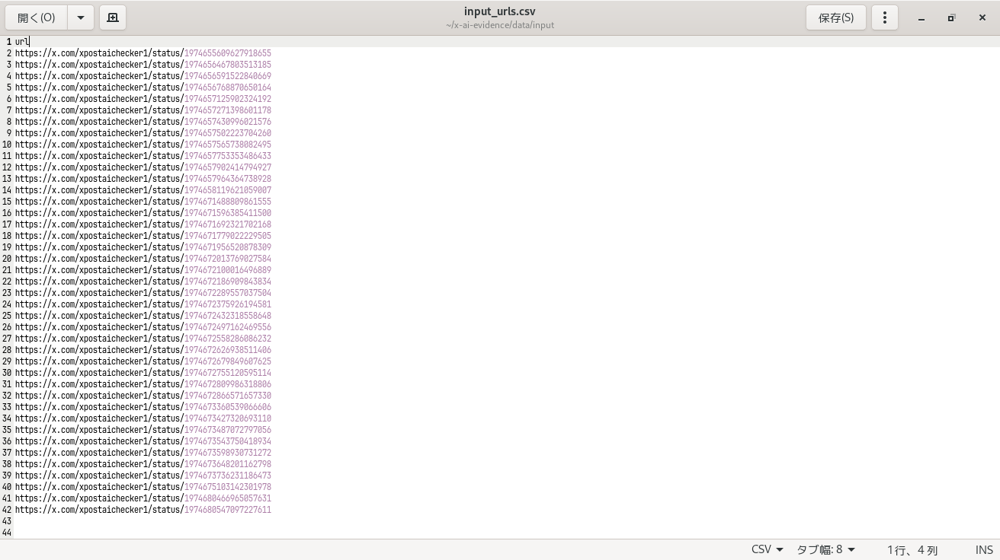
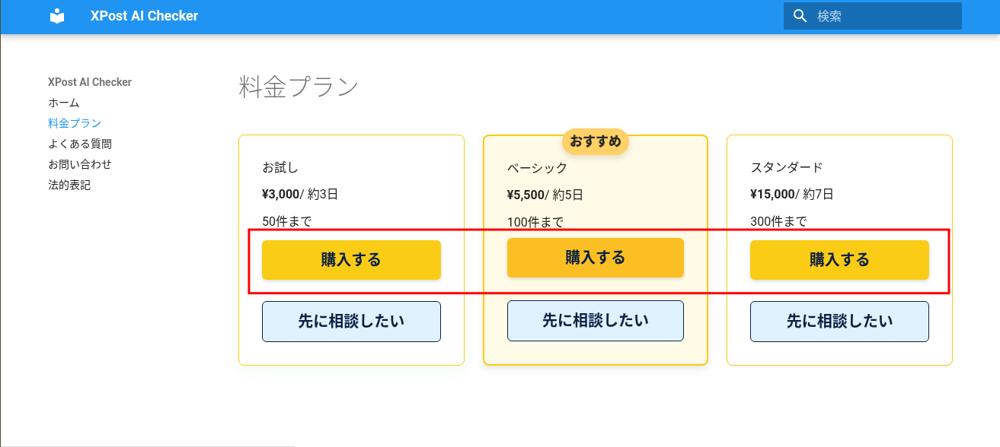
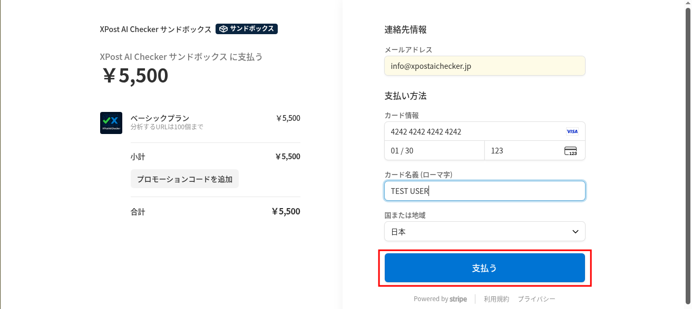
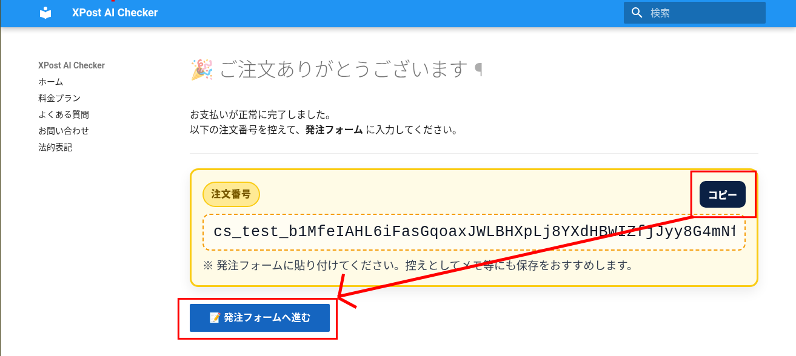
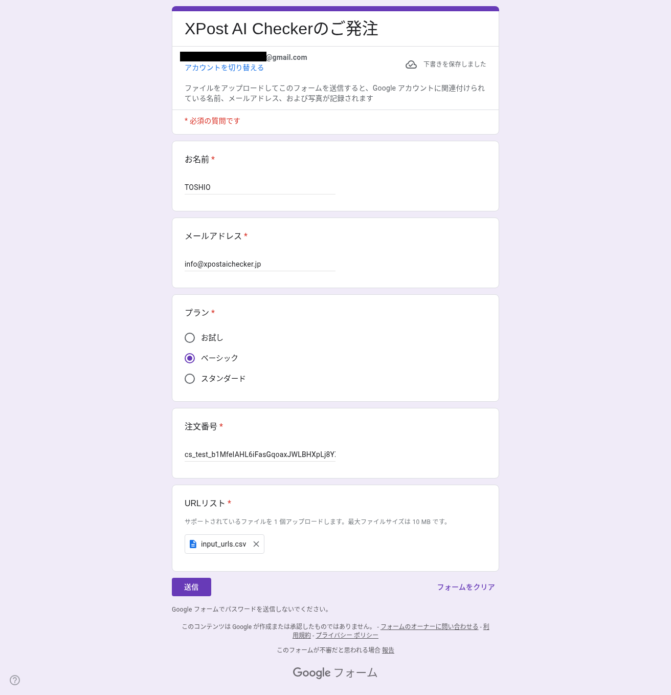

  
  

    <h1>X(Twitter)の誹謗中傷をAIで証拠化｜PDF生成サービス｜XPost AI Checker</h1>
    
<strong>誹謗中傷・脅迫・名誉毀損の投稿をAIが自動分析。証拠PDFを納品します。</strong>

  <a href="plans/" class="btn-cta-primary">今すぐ申し込む</a>
  <a href="contact/" class="btn-cta-secondary">お問い合わせ</a>

    

      
✅  ✅  投稿を自動分類し、懸念度を★1〜5で採点

      
🔍🔍 根拠語句の強調表示

      
📦 📦  PDF/A相当（長期保存可能なPDF）・改ざん防止ハッシュ

    

  

# X(Twitter) 誹謗中傷をAIで分析し、証拠PDFに

## サービス概要

XPost AI Checker は、X（Twitter）投稿をAIで分析し、**問題投稿（名誉毀損/侮辱/脅迫など）を抽出**、**根拠とともにPDFに整理**するサービスです。弁護士相談・削除依頼・訴訟準備に活用できます。

  

    <h3>✅ 自動分類</h3>
    
投稿をカテゴリに自動分類し、懸念度を★1〜5で採点。

  

  

    <h3>🔍 根拠の明記</h3>
    
該当箇所を強調表示し、根拠語句・理由を併記。判断の透明性を担保。

  

  

    <h3>🛡️ 証拠PDF</h3>
    
PDF/A相当（長期保存可能）＋ハッシュで改ざん防止。ZIPで一括納品。

  

## レポート サンプル

  

    
 まとめレポート

    
    <a href="samples/summary_report.pdf" class="mini" target="_blank">まとめPDFを開く</a>
  

  

    
個別エビデンス

    
    <a href="samples/kobetsu.pdf" class="mini" target="_blank">個別PDFを開く</a>
  

## プランと料金
| プラン | 件数 | 価格（税込） | 納期目安 |
|--------|------:|--------------:|----------:|
| お試し | 50件まで | ¥3,000 | 約3日 |
| ベーシック | 100件まで | ¥5,500 | 約5日 |
| スタンダード | 300件まで | ¥15,000 | 約7日 |

[プランの詳細と購入](plans.md){ .md-button }

## ご利用の流れ

1. **URLリストの作成**  
   [テンプレート](samples/input_urls.csv)をダウンロードして、チェックを行いたいX(Twitter)の投稿URLを入力してください。  
    

      
    

 

2. **Stripeでお支払い（カード・GooglePay対応）**  
   ご希望のプランの「購入する」ボタンからお支払いください。  
    

      
      
    

 

3. **発注フォームの入力**  
決済完了後、注文番号と発注フォームのボタンが表示されます。 
提出フォームで注文番号が必要になるので、コピーしてください。 
「発注フォームへ進む」をクリックして、URLリストを提出してください。 
※ファイルの提出には、Googleアカウントが必要です。 
　Googleアカウントをお持ちでない場合は、[お問い合わせ]からご連絡ください。  
    

      
      
    

 

4. **AIが自動分析・PDF生成**  
   AIが投稿を自動で分類し、懸念度（★1〜★5）・根拠語句を抽出します。
 
 

5. **ZIP一括で納品**  
   AI分析結果をZIPで納品します。ダウンロードURLをメールでお送りします。
 

> **対象外が多数と判定された場合は返金します。** 鍵アカウント・削除済み投稿・取得不能URLが多い場合は、**全額または一部返金**いたします。

## 納品内容（成果物）

AI分析の完了後、以下のファイルを **ZIP形式** にまとめてお渡しします。  
このサンプルは実際の納品構成と同一です。

| ファイル / フォルダ | 内容 | 形式 |
|---|---|---|
| `summary_report.pdf` | 全体の集計レポート（件数、カテゴリ内訳、懸念度分布など） | PDF |
| `pdfs/` | 各投稿の個別レポート。本文・URL・懸念度（★1〜5）・カテゴリ・根拠語句・理由・スクリーンショットを掲載 | PDF |
| `screenshots/` | 各投稿のスクリーンショット画像 | PNG |
| `manifest.json` | 納品ファイルのハッシュ値一覧（改ざん検知用） | JSON |
| その他 | 納品説明書.pdf | PDF |

## 納品サンプルのダウンロード

実際の納品物一式（サンプル）をこちらから取得できます。

[output.zip をダウンロード](samples/output.zip){ target=_blank download .md-button }

> サンプルはデモデータであり、実在の投稿とは関係ありません。

## よくある質問（抜粋）
- 鍵付きアカウントは対象外です（公開投稿のみ）。  
- 画像・動画は対象外（テキスト本文のみ）。  
- 削除済み投稿は取得不可。  

詳細は[FAQ](faq.md)をご覧ください。

## 法的・免責
- 本サービスはAIによる分析支援を目的としており、法的判断を代行するものではありません。  
- 詳細は[特定商取引法に基づく表記](legal.md)をご確認ください。

---
## 開発者ブログ

  

    <h2>開発者ブログ</h2>
    
XPost AI Checker の背景や仕組み、使い方を詳しく紹介しています。

  

  

    

      
      <h3>誹謗中傷の証拠を集めるのは大変——だからこのツールを作りました</h3>
      
開発のきっかけと、ツールに込めた思いを紹介しています。

      <a href="/blog/001_xpost-ai-checker-release/index.html" target="_blank" class="blog-link">▶ 記事を読む</a>
    

    

      
      <h3>AIがXの投稿を分析し、証拠PDFを作成するまでの流れ</h3>
      
AIがどのように投稿を分析し、PDFを生成しているのかを解説。

      <a href="/blog/002_xpost-ai-checker-how-it-works/index.html"  target="_blank" class="blog-link">▶ 記事を読む</a>
    

    

      
      <h3>【使い方ガイド】XPost AI Checkerの操作手順と証拠PDFの見方</h3>
      
誰でも使えるシンプルな操作方法を、画像付きでわかりやすく説明しています。

      <a href="/blog/003_xpost-ai-checker-how-to-use/index.html" target="_blank" class="blog-link">▶ 記事を読む</a>
    

  

<!-- 統一CTAブロック（ページ末尾） -->

  <h3>迷ったらまずは「お試し」から</h3>
  
AIが自動で仕分け、<strong>PDF/A準拠の証拠PDF</strong>をお届けします。

  

    <a href="plans/" class="btn-cta-primary">今すぐ申し込む</a>
    <a href="contact/" class="btn-cta-secondary">お問い合わせ</a>
  

