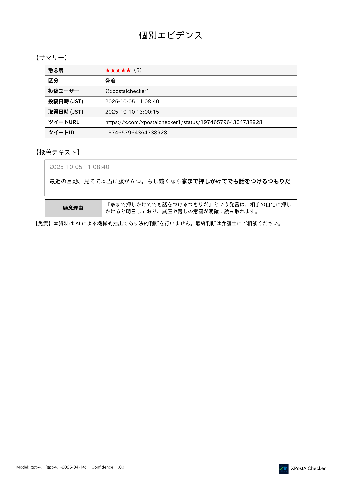

  
  

    <h1>AIでX投稿をチェック！</h1>
    
<strong>誹謗中傷・脅迫・名誉毀損の投稿をAIが自動分析。証拠PDFを最短3日で納品します。</strong>

誹謗中傷に悩むあなたへ。AIが投稿を仕分け、証拠を整えます。

  <a href="plans" class="btn-cta-primary">今すぐ申し込む</a>
  <a href="contact" class="btn-cta-secondary">お問い合わせ</a>

    

      
PDF/A相当・改ざん防止ハッシュ

      
根拠語句の強調表示

      
ZIP一括納品

    

  

## サービス概要
XPost AI Checker は、X（Twitter）投稿をAIで分析し、**問題投稿（名誉毀損/侮辱/脅迫など）を抽出**、**根拠とともにPDFに整理**するサービスです。弁護士相談・削除依頼・訴訟準備に活用できます。

  

    <h3>自動分類</h3>
    
投稿をカテゴリに自動分類し、懸念度を★1〜5で採点。

  

  

    <h3>根拠の明記</h3>
    
該当箇所をハイライトし、根拠語句・理由を併記。判断の透明性を担保。

  

  

    <h3>証拠PDF</h3>
    
PDF/A相当、改ざん防止ハッシュ付き。ZIPで一括納品。

  

## レポート サンプル

  

    
サマリーレポート（1ページ目）

    
    <a href="samples/summary_report.pdf" class="mini" target="_blank">サマリーPDFを開く</a>
  

  

    
個別エビデンス（1ページ目）

    
    <a href="samples/kobetsu.pdf" class="mini" target="_blank">個別PDFを開く</a>
  

  

    
個別エビデンス（2ページ目）

    
    <a href="samples/kobetsu.pdf" class="mini" target="_blank">個別PDFを開く</a>
  

## プランと料金
| プラン | 件数 | 価格（税込） | 納期目安 |
|--------|------:|--------------:|----------:|
| お試し | 50件まで | ¥3,000 | 約3日 |
| ベーシック | 100件まで | ¥5,500 | 約5日 |
| スタンダード | 300件まで | ¥15,000 | 約7日 |

[プランの詳細と購入](plans.md){ .md-button }

## ご利用の流れ
1. [お問い合わせフォーム](contact.md) からURLリスト（CSV）をご送付  
2. Stripeでお支払い（カード・ApplePay対応）  
3. AIが自動分析・PDF生成  
4. ZIP一括で納品

## 納品内容（成果物）

AI分析の完了後、以下のファイルを **ZIP形式** にまとめてお渡しします。  
このサンプルは実際の納品構成と同一です。

| ファイル / フォルダ | 内容 | 形式 |
|---|---|---|
| `summary_report.pdf` | 全体の集計レポート（件数、カテゴリ内訳、懸念度分布など） | PDF |
| `pdfs/` | 各投稿の個別レポート。本文・URL・懸念度（★1〜5）・カテゴリ・根拠語句・理由・スクリーンショットを掲載 | PDF |
| `screenshots/` | 各投稿のスクリーンショット画像 | PNG |
| `manifest.json` | 納品ファイルのハッシュ値一覧（改ざん検知用） | JSON |
| その他 | 納品説明書.pdf | PDF |

> すべてを1つのZIPにまとめ、メールまたはダウンロードリンクでお渡しします。

## 納品サンプルのダウンロード

実際の納品物一式（サンプル）をこちらから取得できます。

[output.zip をダウンロード](samples/output.zip){ target=_blank download .md-button }

> サンプルはデモデータであり、実在の投稿とは関係ありません。

## よくある質問（抜粋）
- 鍵付きアカウントは対象外です（公開投稿のみ）。  
- 画像・動画は対象外（テキスト本文のみ）。  
- 削除済み投稿は取得不可。  

詳細は[FAQ](faq.md)をご覧ください。

## 法的・免責
- 本サービスはAIによる分析支援を目的としており、法的判断を代行するものではありません。  
- 詳細は[特定商取引法に基づく表記](legal.md)をご確認ください。

---
📩 お問い合わせ： info@xpostchecker.jp