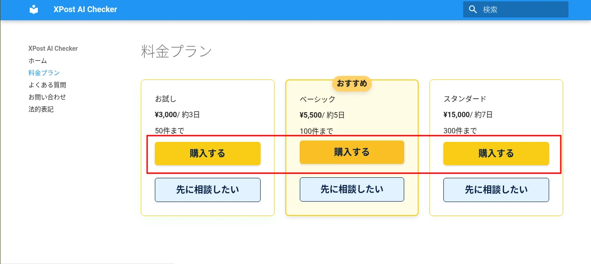
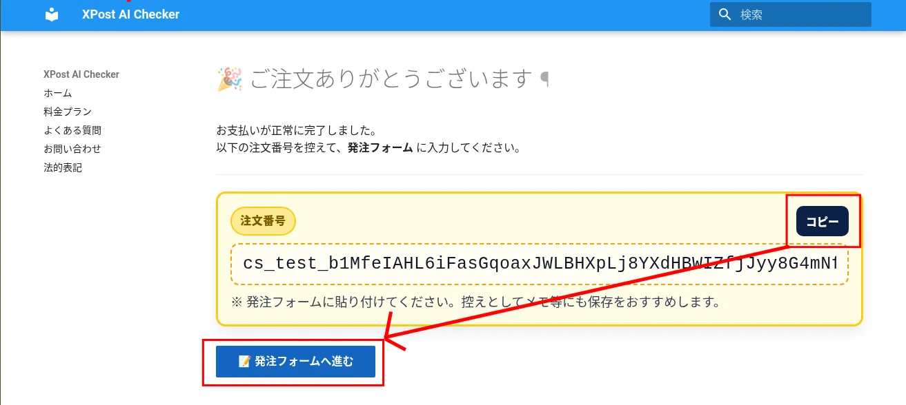

  

    <h1>Xの誹謗中傷を、AIが「証拠PDF」に自動保存します。</h1>
    
SNSで傷つくあなたへ。 感情ではなく、証拠で守るという選択を。

    

      <a href="plans/" class="btn-cta-primary">プランを見る</a>
      <a href="contact/" class="btn-cta-secondary">無料で相談する</a>
    

  

  

---

## XPost AI Checkerとは？（サービスの概要）

XPost AI Checker は、X（Twitter）の誹謗中傷・名誉毀損・脅迫・虚偽通報などの投稿を  
**AIが自動で分析し、証拠PDFを一括で生成するサービス**です。

- 🔍 Xの投稿をAIが自動分類（誹謗中傷・名誉毀損・脅迫・ハラスメント など）
- 💬 懸念度を★1〜5で可視化し、「どれが危険か」をひと目で把握
- 📦 PDF/A準拠の証拠レポートを一括納品（改ざん防止ハッシュ付き）

> 「何から手を付けていいか分からない」  
> そんな状態から、「冷静に動ける状態」へ進めるためのツールです。

---

## あなたも、こんな悩みを抱えていませんか？

- SNSで心ない言葉を投げられた  
- 通報しても、削除されずに拡散された  
- 投稿が消されて、証拠が残らなかった  
- 弁護士に相談したいけど、何を渡せばいいか分からない  

> 「どうしたらいいか分からない」  
> そんな状況を、私たちは何度も見てきました。

---

## AIが、あなたの代わりに冷静に証拠化します

XPost AI Checker は、X（Twitter）の投稿をAIが自動で分析し、  
誹謗中傷・名誉毀損・脅迫などを分類。  
**根拠語句と理由を明示したPDFレポート**を生成します。

- 🔍 投稿をAIが自動分類  
- 💬 懸念度を★1〜5で可視化  
- 📦 証拠PDFを一括納品（PDF/A準拠・改ざん防止ハッシュ付）

> AIは感情に流されません。  
> あなたの代わりに、冷静で客観的な“証拠”を整えます。

---

## なぜ「AIによる証拠化」が必要なのか

SNSの投稿は、一度炎上すると一気に拡散されますが、  
**相手が削除してしまえば、あとから内容を正確にたどることは難しくなります。**

- スクリーンショットだけでは、改ざんの有無が分かりにくい  
- リプライ・引用・スレッドなど、関連投稿が複雑に絡み合う  
- 心身ともに追い込まれていると、冷静な記録作業ができない  

だからこそ、「最初からAIにまかせて整理してもらう」ことには大きな意味があります。  

> **削除される前に、冷静で再現性のある証拠を残す。**  
> そのためのしくみが、XPost AI Checker です。

---

## なぜこのサービスを作ったのか

開発者である私も、SNSでの誹謗中傷を何度も目の当たりにしてきました。  
心ない投稿が拡散され、誤解が広がり、傷ついて眠れなくなる人たち。  
それは決して、特別な誰かの話ではありません。  
いつ、自分や大切な人が同じ目に遭ってもおかしくない――  
そう感じたのが、すべての始まりでした。

---

> 「どうすれば、傷ついた人が冷静に動けるだろうか」  
> 「どうすれば、“感情ではなく事実”で向き合えるのだろうか」

この問いに向き合い続けた結果、私が見つけた答えが「AI」でした。  
AIなら、怒りや悲しみに影響されることなく、  
冷静に言葉のニュアンスや脅迫性を分析できる。  
人の感情を支えるために、**感情に左右されない仕組み**を作ろう。  
そう決意して、XPost AI Checkerの開発を始めました。

---

もちろん、最初からうまくいったわけではありません。   
思うように精度が出ず、何度も立ち止まりました。  

それでも、「正しく守るためにこそ正確でありたい」という想いだけで続けてきました。  

---

こうしてようやく、**弁護士相談や削除依頼にも使えるレベル**の証拠PDFを  
安定して生成できるようになったのです。  

> 完璧ではなくても、「正確で誠実」なAIを。  
> それが、私の信念です。  

SNSで傷ついた人が、冷静に、そして確実に前へ進めるように。  
このサービスは、そんな願いから生まれました。

---

## 実際のレポート（サンプル）

  

    
まとめレポート

    
    <a href="samples/summary_report.pdf" class="mini" target="_blank">PDFを開く</a>
  

  

    
個別エビデンス

    
    <a href="samples/kobetsu.pdf" class="mini" target="_blank">PDFを開く</a>
  

> これが、AIが生成する“あなたの代わりに冷静な証拠”です。  

---

## あなたが得られるもの（X誹謗中傷の証拠を残すメリット）

| 項目 | 内容 |
|------|------|
| 🕒 時間の節約 | スクショ作業・分類作業を自動化。数百件でもまとめて処理。 |
| 🧠 精神的な安心 | 感情的に対処せず、冷静な資料を残せる。 |
| 🧾 証拠力 | PDF/A相当の形式＋改ざん防止ハッシュ付き。 |
| ⚖️ 活用範囲 | 弁護士相談、削除依頼、警察相談などに転用可能。 |

> 「AIが整えた証拠」を手にした瞬間、あなたの不安は“整理された事実”に変わります。

---

## プランと料金

| プラン | 件数 | 価格（税込） | 納期目安 |
|--------|------:|--------------:|----------:|
| お試し | 50件まで | ¥3,000 | 約3日 |
| ベーシック | 100件まで | ¥5,500 | 約5日 |
| スタンダード | 300件まで | ¥15,000 | 約7日 |

[プランの詳細を見る](plans.md){ .md-button }

> 対象外が多い場合は返金いたします。  
> 安心してご利用ください。

---

## ご利用の流れ

1. **URLリストの作成**  
   [テンプレート](samples/input_urls.csv)をダウンロードして、チェックを行いたいX(Twitter)の投稿URLを入力してください。  
    

      
    

 

2. **Stripeでお支払い（カード・GooglePay対応）**  
   ご希望のプランの「購入する」ボタンからお支払いください。  
    

      
      
    

 

3. **発注フォームの入力**  
決済完了後、注文番号と発注フォームのボタンが表示されます。 
提出フォームで注文番号が必要になるので、コピーしてください。 
「発注フォームへ進む」をクリックして、URLリストを提出してください。 
※ファイルの提出には、Googleアカウントが必要です。 
　Googleアカウントをお持ちでない場合は、[お問い合わせ]からご連絡ください。  
    

      
      
    

 

4. **AIが自動分析・PDF生成**  
   AIが投稿を自動で分類し、懸念度（★1〜★5）・根拠語句を抽出します。
 
 

5. **ZIP一括で納品**  
   AI分析結果をZIPで納品します。ダウンロードURLをメールでお送りします。
 

> 鍵アカウント・削除済み投稿は対象外ですが、  
> 対象外が多い場合は**全額または一部返金**いたします。

---

## 納品内容（成果物）

AI分析の完了後、以下のファイルを **ZIP形式** にまとめてお渡しします。  
このサンプルは実際の納品構成と同一です。

| ファイル / フォルダ | 内容 | 形式 |
|---|---|---|
| `summary_report.pdf` | 全体の集計レポート（件数、カテゴリ内訳、懸念度分布など） | PDF |
| `pdfs/` | 各投稿の個別レポート。本文・URL・懸念度（★1〜5）・カテゴリ・根拠語句・理由・スクリーンショットを掲載 | PDF |
| `screenshots/` | 各投稿のスクリーンショット画像 | PNG |
| `manifest.json` | 納品ファイルのハッシュ値一覧（改ざん検知用） | JSON |
| その他 | 納品説明書.pdf | PDF |

---

## 納品サンプルのダウンロード

実際の納品物一式（サンプル）をこちらから取得できます。

[output.zip をダウンロード](samples/output.zip){ target=_blank download .md-button }

> サンプルはデモデータであり、実在の投稿とは関係ありません。

---

## よくある質問

- Q. 鍵付きアカウントは対象ですか？  
  A. 対象外です（公開投稿のみ）。  
- Q. 画像や動画は分析されますか？  
  A. テキスト本文のみが対象です。  
- Q. 削除済み投稿は？  
  A. 取得できないため除外となります。  

詳細は[FAQ](faq.md)をご覧ください。

---

## 法的・免責

- 本サービスはAIによる分析支援を目的としており、法的判断を代行するものではありません。  
- 詳細は[特定商取引法に基づく表記](legal.md)をご確認ください。

---

## 開発者からあなたへ

> SNSで傷つく人を、少しでも減らしたい。  
>  
> 「冷静に、正確に、そして確実に」——  
> 感情ではなく“証拠”で立ち向かえるように。  
>  
> その一歩を、AIがあなたと共に歩みます。

---

<!-- 統一CTAブロック（ページ末尾） -->

  <h3>迷ったらまずは「お試し」から</h3>
  
AIが自動で仕分け、<strong>PDF/A準拠の証拠PDF</strong>をお届けします。

  

    <a href="plans/" class="btn-cta-primary">プランを見る</a>
    <a href="contact/" class="btn-cta-secondary">無料で相談する</a>
  

